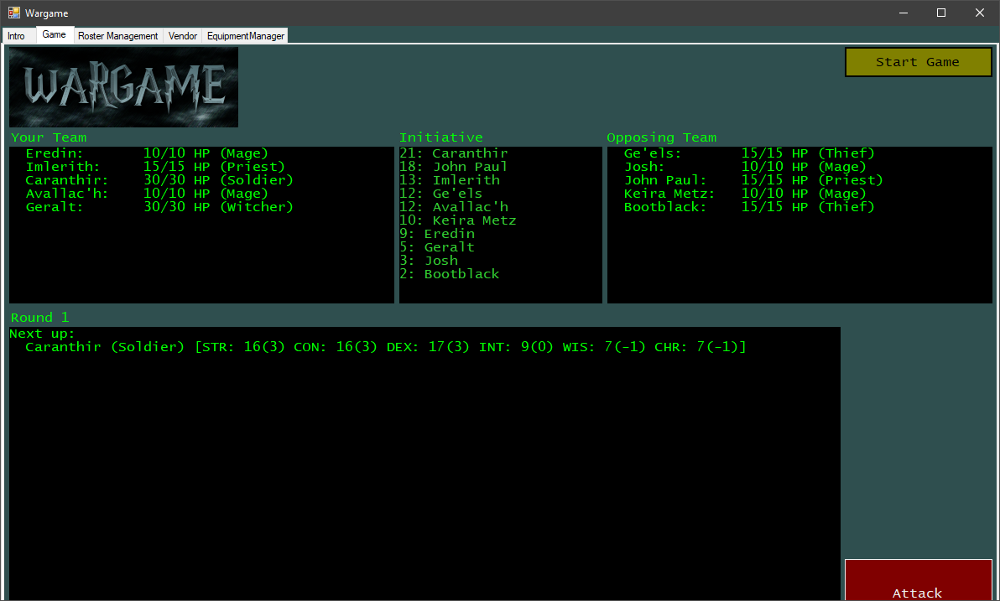

# wargame

hour of code project

a simple generic fantasy game to practice .NET and C#. 

characters play in initiative order, attacking a random opponent until all players on one team are dead.

## next up

* stat modifiers
* play as one character
~~* buy items~~
~~* equip/unequip items~~
~~* build your own teams~~
